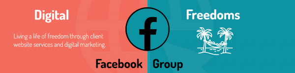

  
In my last post I said I would talk about nomadic living costs. It turns out this is a huge topic that gives me writer’s cramp and make me introspective.  Instead, I thought I would follow up with a little more context as to why we now focus on hosting and care.

So with no further ado, dilly-dally or shilly-shally we’ll get started.

## #1 It Provides A Financial Safety Net

-   **As a couple we could live comfortably by a beach in Asia for $10K a year.**
-   **40 clients paying hosting and maintenance at $400 a year = $16K income.**
-   **Server and software costs = $4K.**
-   **This leaves $2K for the unexpected or lollipops**.

Our living costs have always been much higher due to the type of travel and regular doubling of accommodation costs. However, assuming you acquire a little local knowledge, $10k would get you a clean one bedroom apartment minutes from the beach, allow you to run a scooter, and mostly not need to cook.

## #2 Working hours

Based on approximately 40-60 sites it’s:

-   **15 minutes of daily updates (91 hours pa).**
-   **Approximately 1 hour on monthly check and fixes (12 hours pa).**
-   **Major software changes (30 hours pa).**
-   **Time retaining relationships/ unexpected gestures (30 hours pa).**
-   **Total hours 163 yearly.**
-   **Available working hours = 1,872 pa (39 hours per week with 4 weeks leave).**

Our living costs are based on the two of us meaning there are double the working hours available. My wife did not take long to learn most of the skills needed to take over this.

Assuming you manage the sites you built and use similar and reliable software, this seems very easily scalable to 100 sites (or $40K pa).

Presently we manage over 60 sites within theses hours, but some are our own and some on a half-priced deal set up for my friend’s clients who may have been served better by a simple HTML site.

## \# 3 Generates more business

-   **It puts us forefront in people’s minds for redesign and new projects.**
-   **Increased likelihood of getting referrals (possibly the best kind of marketing available).**
-   **Having an audience to up sell to (SEO, Funnels, Landing pages, Analytics etc).**

We have yearly plans, but automatic monthly reports help to remind clients of us. Also we have allowed 4 days work per year to do little extras that go beyond our paid service. For example, helping with GDPR, adding Google analytics tools and doing the odd chargeable jobs for free.

I have over the year picked up some deals of things like SEO rack checking, heat-mapping, A/B testing tools. Things that have a high monthly subscription. Most go unused, but can be offered to a client for free to both increase goodwill and potentially interesting them in taking their digital marketing a step further.

## Considerations

### Churn

We will always have clients who close their business or want to change supplier. How much is probably going to depend on the type of client you attract and how you treat them.  We have not had our present package long enough to predict this.

As mentioned in the last post I worked with a friend on her client’s sites and when she closed her business a year ago we had a drop of people she gave face to face support. However we have replaced them over the year.

I am working to a 10% rate. On the minimum of 40 site that’s only 4 web projects a year to find

### Increasing supplier costs

We are dependent on the software and service companies we use. So far (and due to very cautious selecting) We have not had our prices increased. In fact we use Digital Ocean who halved their costs. Website companies like Gravity Forms who increased their charges Grandfathered existing customers.

In my early days of buying Website products and services, I was carried away with the new buzz and popularity of products seemed to offer more than their competitors. That has probably never been as much aggressive, but effective, marketing in the WordPress space as there is now, but I think with a bit of research it is not too difficult to find those who would never consider bait and switch practices.

### Disasters

Servers going down and multiple sites getting hacked come to mind, but there is also the relentless march of progress as new technology usurps the old.

Mostly I think I have that covered. My Digital Ocean server has never had any downtime in over 4 years. Good scanning and storing lots of back up makes me feel secure about hacked sites. The most difficult is changing software and above I have allowed 4 days for this.

Presumably there will come a point where something crucial will start to become obsolete. Perhaps the Gutenberg project in WordPress will get to a point where it does all and more of what my trusted page builder Beaver Builder does. If so I suspect the change will occur naturally as it has when I moved from hard coding via the Genesis Framework to using Beaver Builder. The old software lasted, and the changeover happened as clients naturally decided to have redesigns.

### The learning curve

As mentioned in my last post. I wish easier cloud hosting and the needed maintenance was there when I started building sites. Those first sites I built for peanuts and even for free would have set me up well, but I wonder if I would have seen the opportunity or put the time in.

There is no doubt that to get the most cost effective hosting and maintenance you have to tax yourself mentally. More exciting to me for many years was learning all the cool stuff I could do with website building itself.

I have seen new hosting companies emerge from nothing to being some of the most popular among web designers and developers who don’t want to be bothered. If you are different and want to know more about my set I would love to hear from you so I can create useful content.

